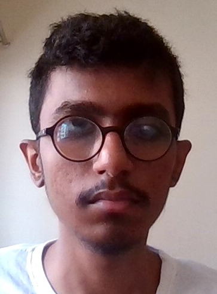

Mohammad Umar Sayed
===================

* * *

I am **Mohammad Umar Sayed.**  
I am from **Mumbai**, currently persuing my **BTech** in _CSE_ form **IIT Goa**.  
I loves playing _football_ and to Code.

* * *

### Education

| Year of Graduation | Degree | Institution |
| ------------------ | ------ | ----------- |
| 2025 | BTech  | Indian Institute of Technology Goa |
| 2021 | 12th | Somaiya Junior College |
| 2019 | 10th | Anjuman Secondary School |

* * *

### 1st year cources @IIT Goa

#### Autumn

*   **CH101**: Physical Chemistry _Dr. E Siva Subhramanyam Iyer_
*   **CH102**: Inorganic and Organic Chemistry _Dr.Raja Mitra_ and _Dr. Rishikesh Narayan_
*   **CH104**: Chemstry Lab II _Dr. E Siva Subhramanyam Iyer_, _Dr.Raja Mitra_ and _Dr. Rishikesh Narayan_
*   **CS100**: Introduction To Profession _Neha Ma'am_
*   **CS101**: Introduction to Computing _Dr. Clint P. George_ [CS101 Link](https://clintpgeorge.github.io/cs-101/autumn-2021/)
*   **HS101**: Foundation program in Humanities and Social Science _Dr.Sabiha_
*   **MTH101**: Calculus _Sandipan De_
*   **NO101**: National Sports Organisation _Santosh Upadhyay_
*   **PH101**: Quantom Physich and Applications _Dr.Santosh Kumar Das_

#### Spring

1.  **BIO101**: Introductory Biology _Dr. Balakrishna_
2.  **Cs102**: Software Tooles _Dr. Clint P. George_ [CS102 Link](https://clintpgeorge.github.io/cs-101/autumn-2021/)
3.  **EE101**: Introduction To Electrical And Electronics Engineering _Dr. Sheron F_
4.  **ME102**: Engineering Drawing and Introduction to computer aided drawing
5.  **MTH1021**: Basic Linear Algebra _Dr. Kalpesh Haria_
6.  **NO102**: National Sports Organisation _Santosh Upadhyay_
7.  **PH102**: Electricity and Magnitism _Dr. Vaibhav Wasnik_
8.  **PH104**: Physics Lab II _Dr. Vaibhav Wasnik_, _Dr. Santosh Kumar Das_

* * *

### Hobbies

I likes _football_ and _cricket_ and I often plays **football** with my friends and seniors on campus although I am learning it from beginning. I also plays _video games_ sometimes, particularly in my free time.

### Achievements

I am a **2 Star** coder at ***CodeChef*** with the rating of _1460_. I can code in both ___Python___ as well as in ___C++___. I have also done **Kotlin** and **Dart** for __Android Development__ and learning **Django** for __Backend Web Development.__